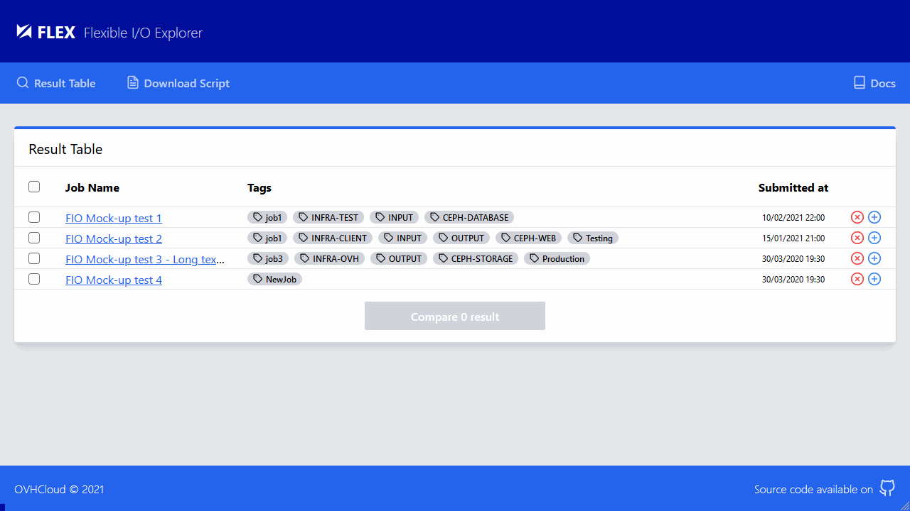

<!-- Logo -->
<p align="center">
  <a href="https://github.com/IMT-Atlantique-FIP2021/fiowebviewer-frontend/">
    
  </a>
</p>

<!-- Name -->
<h1 align="center">
  <a href="https://github.com/IMT-Atlantique-FIP2021/fiowebviewer-frontend/"><b>FLEX</b> Flexible I/O Explorer</a>
  </br>
  <i>Frontend repository</i>
</h1>

[][WS_REACT]
[][WS_TWCSS]

> React modules :
> 
> [][WS_REACT_CRA]
> [][WS_REACT_ROUTER]
> [][WS_REACT_FEATHER]

> Tailwindcss plugins :
> 
> [][WS_TWCSS_FORMS]
> [][WS_TWCSS_SCROLLBAR]

## Screenshots



## Installation & Usage

- Installer [NodeJS 14.X LTS](https://github.com/nodesource/distributions/blob/master/README.md#debinstall)
- Cloner le répertoire
- Initialiser les paquets npm
- Démarrer le serveur de développement

```shell
$ git clone https://github.com/IMT-Atlantique-FIP2021/fiowebviewer-frontend
$ cd fiowebviewer-frontend/
$ npm install
$ npm start
...
```

> :warning: En cas de problème au démarrage du serveur de développement, indiquant dans la console des erreurs relatives à une allocation mémoire insufisante, aller voir l'[Issue #12](https://github.com/IMT-Atlantique-FIP2021/fiowebviewer-frontend/issues/12).

## How to contribute

> TODO...


<!-- URL Index -->

[WS_REACT]: https://reactjs.org/docs/getting-started.html
[WS_REACT_ROUTER]: https://reactrouter.com/web/guides/quick-start
[WS_REACT_FEATHER]: https://feathericons.com/
[WS_REACT_CRA]: https://create-react-app.dev/

[WS_TWCSS]: https://tailwindcss.com/docs
[WS_TWCSS_FORMS]: https://github.com/tailwindlabs/tailwindcss-forms
[WS_TWCSS_SCROLLBAR]: https://github.com/adoxography/tailwind-scrollbar

[ProjectDoc]: ./docs/project_setup.md