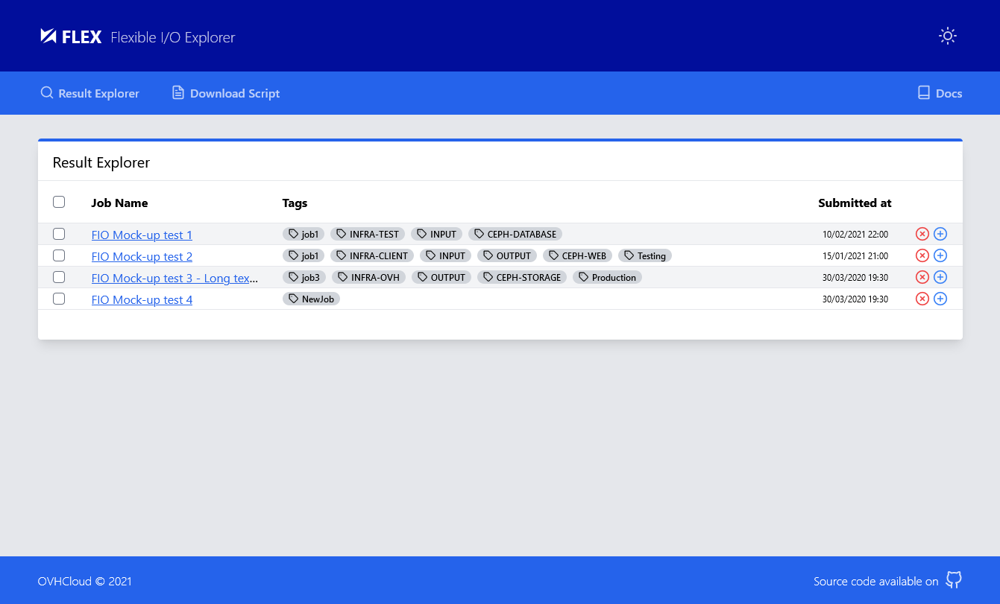

<!-- Logo -->
<p align="center">
  <a href="https://github.com/IMT-Atlantique-FIP2021/fiowebviewer-frontend/">
    
  </a>
</p>

<!-- Name -->
<h1 align="center">
  <a href="https://github.com/IMT-Atlantique-FIP2021/fiowebviewer-frontend/"><b>FLEX</b> Flexible I/O Explorer</a>
</h1>

## Installation & Usage

```shell
$ npm install
...
$ npm start
...
```

> If error start showing in console about memory, check [issue #12](https://github.com/IMT-Atlantique-FIP2021/fiowebviewer-frontend/issues/12).

<!-- See the [**Documentation**][ProjectDoc] for an introduction, usage information, and examples. -->

## Screenshots



## Built With

- Frontend
  - [React][ReactDoc] (JavaScript Framework)
    - [React Router][ReactP_Router]
  - [Tailwindcss][TailwindDoc] (CSS Framework)
    - [tailwind-scrollbar][TWP_scroll] (plugin)
- Backend
  - [Flask][FlaskDoc] (Python Framework) | _Moving to [FastAPI][FastAPIDoc]?_
- Tools
  - virtualenv
  - npm
  - [Create-React-App][CRADoc] (Frontend boilerplate)
  - [Feather][FeatherIcons] (SVG Icons)
- Browser dev tools
  - [React DevTools][ReactDevTool]

# Ideas

To sort:

- [Bootstrap table examples](https://examples.bootstrap-table.com/)
- [Getting started: Flask+React](https://blog.learningdollars.com/2019/11/29/how-to-serve-a-reactapp-with-a-flask-server/)

<!-- URL Index -->

[ProjectDoc]: ./docs/project_setup.md
[ReactDoc]: https://reactjs.org/docs/getting-started.html
[TailwindDoc]: https://tailwindcss.com/docs
[FlaskDoc]: https://flask.palletsprojects.com/en/1.1.x/
[FastAPIDoc]: https://fastapi.tiangolo.com/
[CRADoc]: https://github.com/vitejs/vite
[FeatherIcons]: https://feathericons.com/
[ReactDevTool]: https://addons.mozilla.org/en-US/firefox/addon/react-devtools/
[TWP_scroll]: https://github.com/adoxography/tailwind-scrollbar
[ReactP_Router]: https://reactrouter.com/web/example/basic